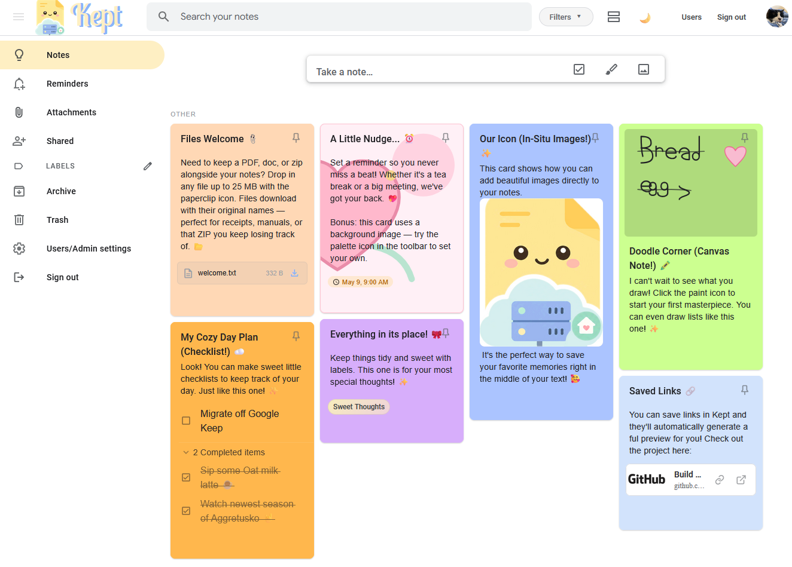

<div align="center">
  
  <br>
  

# Kept

### Self-hosted notes with a Google Keep-style feel

</div>

Kept is a self-hosted notes app built for quick capture: text notes, checklists, images, drawings, links, attachments, labels, colors, and reminders. It aims to keep the lightweight feel of Google Keep while storing your data on your own server.

<p>
  <a href="https://apps.apple.com/ca/app/kept-notes/id6768974473">
    
  </a>
  <a href="https://ko-fi.com/kept_notes">
    
  </a>
</p>

## Screenshot



## Why Kept Exists

I wanted something that felt like Google Keep: fast, colorful, easy to glance at, and never too heavy for a quick thought. Most self-hosted notes apps I tried were either powerful but fiddly, or simple but missing the feel I wanted. Kept is my attempt at that middle ground, with the data staying on a server you control.

## Features

- Text notes, checklists, image notes, drawings, links, and file attachments.
- Drag-and-drop note ordering and checklist item ordering.
- Labels, colors, background images, pinned notes, archive, and trash.
- Search and filters, including note type, labels, and date-style queries.
- Link previews and inline images.
- Time reminders with browser push notifications.
- Location-based reminders through the native iOS app.
- Real-time shared notes between users on the same instance.
- Offline note viewing/editing with sync when the client reconnects.
- Google Keep Takeout import.
- Built-in database backups and restore flow.
- Local user accounts, optional 2FA, and user management.

## Native iOS App

[Kept Notes is available on the App Store](https://apps.apple.com/ca/app/kept-notes/id6768974473). It connects to your self-hosted Kept server and adds native iPhone/iPad integration:

- Apple Reminders support.
- Arrival/departure reminders for saved locations.
- Local Smart Capture using Apple Intelligence where supported.
- A native app shell around your Kept server.

## PWA / Mobile Browser

The web app can also be installed as a PWA on iOS and Android. For push notifications and reliable mobile installs, Kept needs to be served from a real `https://` URL.

The short setup guide is on the [Kept website](https://www.keepitkept.xyz/#pwa-mobile).

## Install With Docker

Requirements:

- Docker with Compose
- Git

```bash
git clone https://github.com/ericerkz/kept.git
cd kept
docker compose up -d --build
```

Open `http://localhost:6767` and create the first admin account.

Kept stores its database, uploads, attachments, and generated server data in `./data`. Back that folder up if you are not using the built-in backup tools.

## Native Install

Docker is recommended, but Kept can also run directly on Node.js v24.x.

Linux/macOS:

```bash
chmod +x install-native.sh
sudo ./install-native.sh
```

Windows PowerShell, run as Administrator:

```powershell
.\install-native.ps1
```

Without the service setup, start the server manually:

```bash
PORT=6767 npm run api
```

On Windows:

```powershell
$env:PORT=6767; npm run api
```

## Reverse Proxy / HTTPS

Use HTTPS if you want public access, PWA installs, OAuth redirects, or push notifications. Point your proxy at `127.0.0.1:6767`.

Realtime presence and collaborative editing use WebSockets at `/api/realtime`, so proxy that path with WebSocket upgrade support.

Apache example:

```apache
# Required once:
# sudo a2enmod proxy proxy_http proxy_wstunnel rewrite ssl
# sudo systemctl reload apache2

<VirtualHost *:80>
    ServerName kept.example.com
    Redirect permanent / https://kept.example.com/
</VirtualHost>

<IfModule mod_ssl.c>
<VirtualHost *:443>
    ServerName kept.example.com
    ProxyRequests Off
    ProxyPreserveHost On

    ProxyPass /api/realtime ws://127.0.0.1:6767/api/realtime
    ProxyPassReverse /api/realtime ws://127.0.0.1:6767/api/realtime

    ProxyPass / http://127.0.0.1:6767/
    ProxyPassReverse / http://127.0.0.1:6767/

    SSLEngine on
    SSLCertificateFile /etc/letsencrypt/live/kept.example.com/fullchain.pem
    SSLCertificateKeyFile /etc/letsencrypt/live/kept.example.com/privkey.pem
</VirtualHost>
</IfModule>
```

Nginx example:

```nginx
server {
    listen 80;
    server_name kept.example.com;
    return 301 https://$host$request_uri;
}

server {
    listen 443 ssl http2;
    server_name kept.example.com;

    ssl_certificate /etc/letsencrypt/live/kept.example.com/fullchain.pem;
    ssl_certificate_key /etc/letsencrypt/live/kept.example.com/privkey.pem;

    location /api/realtime {
        proxy_pass http://127.0.0.1:6767/api/realtime;
        proxy_http_version 1.1;
        proxy_set_header Upgrade $http_upgrade;
        proxy_set_header Connection "upgrade";
        proxy_set_header Host $host;
        proxy_set_header X-Forwarded-For $proxy_add_x_forwarded_for;
        proxy_set_header X-Forwarded-Proto $scheme;
    }

    location / {
        proxy_pass http://127.0.0.1:6767;
        proxy_set_header Host $host;
        proxy_set_header X-Forwarded-For $proxy_add_x_forwarded_for;
        proxy_set_header X-Forwarded-Proto $scheme;
    }
}
```

## Backups And Restore

Kept can create consistent SQLite backups while the app is running. Admin users can schedule daily, weekly, or monthly backups from User Management, or create one manually.

To restore from a backup during setup:

1. Set `KEPT_ALLOW_RESTORE=1`.
2. Restart Kept.
3. Upload the backup file from the setup screen.
4. Remove `KEPT_ALLOW_RESTORE` and restart again.

The restore flag is intentionally opt-in so the restore endpoint is not left open on a public instance.

## Updating

```bash
cd kept
git pull
docker compose up -d --build
```

Your `./data` folder is not replaced by updates.

## Configuration

Useful environment variables are documented in `docker-compose.yml`. The common ones are:

- `BASE_URL`: public URL for OAuth/callback generation when proxy headers are not enough.
- `KEPT_SESSION_TTL_DAYS`: login session lifetime. Defaults to 30 days.
- `KEPT_CORS_ALLOW_ALL` / `KEPT_CORS_ORIGINS`: CORS behavior for remote clients and native shells.
- `PUID` / `PGID`: run the container as a specific Linux user/group.
- `KEPT_ALLOW_RESTORE`: temporarily enables restore from backup during setup.

## Development

Kept is an Angular app with a Node/Express backend and SQLite storage.

```bash
npm install
npm run start
```

Useful scripts:

- `npm run build`
- `npm run test:sync`
- `npm run api`
- `npm run client`

## Acknowledgement

Kept's original UI scaffolding was forked from [aBrihoum/google-keep-clone](https://github.com/aBrihoum/google-keep-clone). The project has since been substantially rewritten and extended into a full self-hosted notes platform — but the visual foundation came from that earlier work, and the credit is gratefully due.
