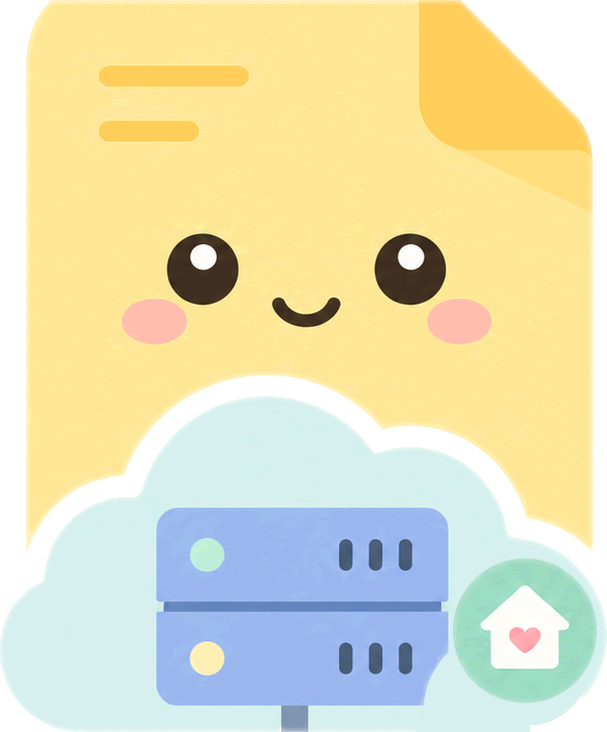
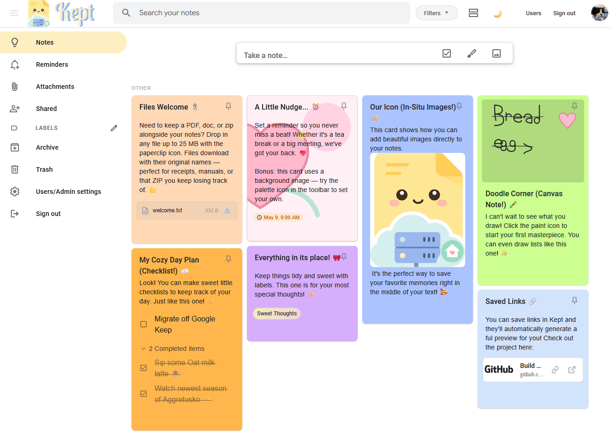

<div align="center">
  
  <br>
  

# Kept

### Self-hosted notes with a Google Keep-style feel

</div>

Kept is a self-hosted notes app built for quick capture: text notes, checklists, images, drawings, links, attachments, labels, colors, and reminders. It aims to keep the lightweight feel of Google Keep while storing your data on your own server.

<p>
  <a href="https://apps.apple.com/ca/app/kept-notes/id6768974473">
    
  </a>
  <a href="https://play.google.com/store/apps/details?id=xyz.keepitkept.app">
    
  </a>
  <a href="https://ko-fi.com/kept_notes">
    
  </a>
</p>

<p>
  <a href="https://railway.com/deploy/kept-notes">
    
  </a>
</p>

## Screenshot



## Why Kept Exists

I wanted something that felt like Google Keep: fast, colorful, easy to glance at, and never too heavy for a quick thought. Most self-hosted notes apps I tried were either powerful but fiddly, or simple but missing the feel I wanted. Kept is my attempt at replicating the simplicity of Google Keep, while keeping the data on a server you control.

## Features

- Text notes, checklists, image notes, drawings, links, and file attachments.
- Drag-and-drop note ordering and checklist item ordering.
- Labels, binders, colors, background images, pinned notes, archive, and trash.
- Search and filters, including note type, labels, and date-style queries.
- Link previews and inline images.
- Time reminders with browser push notifications.
- Location-based reminders through the native iOS and Android apps.
- Quick share to Kept from the native iOS and Android share sheets.
- Android home screen widget for recent or pinned notes.
- Real-time collaborative sharing of notes between users on the same instance.
- Offline note viewing/editing with automatic sync when the client reconnects.
- Google Keep Takeout data import.
- Built-in database backups and restore flow.
- Local user accounts, optional 2FA, and user management.
- Local MCP server for authenticated agent access without direct database access.

## Install With Docker

Requirements:

- Docker with Compose
- Git

Kept's recommended install path is to use the published Docker image: `ghcr.io/ericerkz/kept:latest`.

```bash
git clone https://github.com/ericerkz/kept.git
cd kept
docker compose up -d
```

Open `http://localhost:6767` and create the first admin account.

Kept stores its database, uploads, attachments, and generated server data in `./data`. Back that folder up if you are not using the built-in backup tools.

## Agent Access With MCP

Kept includes a local stdio MCP server for scoped agent access to notes and
labels through the authenticated Kept API. See [the MCP setup and security
guide](docs/mcp.md).

## Easy Hosted Setup

If you do not want to set up Docker or manage a server yourself, Railway can create a ready-to-use Kept instance for you in a few clicks.

[](https://railway.com/deploy/kept-notes)

Railway handles the technical setup:

- Runs Kept for you
- Keeps storage attached for your notes and attachments
- Sets the required configuration
- Gives you a public HTTPS link to open in your browser

Once deployment finishes, open the link Railway gives you and create your first Kept account.

Railway is one convenient way to deploy Kept quickly. Kept remains self-hostable on any platform that supports Docker.

## Native iOS App

[Kept Notes is available on the App Store](https://apps.apple.com/ca/app/kept-notes/id6768974473). It connects to your self-hosted Kept server and adds native iPhone/iPad integration:

- Apple Reminders support.
- Location reminders with arrival/departure settings, and the ability to save locations
- Quick share into Kept from the iOS share sheet.
- On-device Smart Capture using Apple Intelligence.
- A native app shell around your Kept instance.

## Native Android App

[Kept Notes is available on Google Play](https://play.google.com/store/apps/details?id=xyz.keepitkept.app). It connects to your self-hosted Kept server and adds native Android integration:

- Location reminders with arrival/departure settings, background geofencing, and saved places.
- Quick share into Kept from the Android share sheet.
- Home screen widget for recent or pinned notes.
- On-device Smart Capture using Android's native Gemini Nano when available, or Kept's local Gemma fallback model on Android devices that need it.
- A native app shell around your Kept instance.

## PWA / Mobile Browser

The Kept web app can also be installed as a PWA on iOS and Android. For push notifications and reliable mobile installs, Kept needs to be served from a secure `https://` URL. Location-based reminders require the native iOS or Android app.

The short setup guide is on the [Kept website](https://www.keepitkept.xyz/#pwa-mobile).

## Reverse Proxy / HTTPS

Use HTTPS if you want public access, PWA installs, OAuth redirects, or push notifications. Point your proxy at `127.0.0.1:6767`.

Realtime presence and collaborative editing use WebSockets at `/api/realtime`, so proxy that path with WebSocket upgrade support.

Apache example:

```apache
# Required once:
# sudo a2enmod proxy proxy_http proxy_wstunnel rewrite ssl
# sudo systemctl reload apache2

<VirtualHost *:80>
    ServerName kept.example.com
    Redirect permanent / https://kept.example.com/
</VirtualHost>

<IfModule mod_ssl.c>
<VirtualHost *:443>
    ServerName kept.example.com
    ProxyRequests Off
    ProxyPreserveHost On

    ProxyPass /api/realtime ws://127.0.0.1:6767/api/realtime
    ProxyPassReverse /api/realtime ws://127.0.0.1:6767/api/realtime

    ProxyPass / http://127.0.0.1:6767/
    ProxyPassReverse / http://127.0.0.1:6767/

    SSLEngine on
    SSLCertificateFile /etc/letsencrypt/live/kept.example.com/fullchain.pem
    SSLCertificateKeyFile /etc/letsencrypt/live/kept.example.com/privkey.pem
</VirtualHost>
</IfModule>
```

Nginx example:

```nginx
server {
    listen 80;
    server_name kept.example.com;
    return 301 https://$host$request_uri;
}

server {
    listen 443 ssl http2;
    server_name kept.example.com;

    ssl_certificate /etc/letsencrypt/live/kept.example.com/fullchain.pem;
    ssl_certificate_key /etc/letsencrypt/live/kept.example.com/privkey.pem;

    location /api/realtime {
        proxy_pass http://127.0.0.1:6767/api/realtime;
        proxy_http_version 1.1;
        proxy_set_header Upgrade $http_upgrade;
        proxy_set_header Connection "upgrade";
        proxy_set_header Host $host;
        proxy_set_header X-Forwarded-For $proxy_add_x_forwarded_for;
        proxy_set_header X-Forwarded-Proto $scheme;
    }

    location / {
        proxy_pass http://127.0.0.1:6767;
        proxy_set_header Host $host;
        proxy_set_header X-Forwarded-For $proxy_add_x_forwarded_for;
        proxy_set_header X-Forwarded-Proto $scheme;
    }
}
```

### Advanced config

#### VPN/Tailscale/WireGuard setups

If you access Kept through Tailscale, WireGuard, another VPN, a LAN hostname/IP, or more than one reverse-proxy domain, the CORS settings may be relevant. These setups do not require special CORS settings by themselves; CORS only matters when the browser page and Kept API are reached through different origins, or when you restrict origins with `KEPT_CORS_ORIGINS`. If you use `KEPT_CORS_ORIGINS`, include each exact browser origin you use, such as your Tailnet name, VPN-only domain, LAN IP, or public reverse-proxy domain, including the scheme and port when applicable. For the simplest personal setup, leave `KEPT_CORS_ALLOW_ALL=1` enabled instead. Same-origin access does not need extra CORS configuration.

#### Custom header support in the mobile apps

The native iOS and Android apps support optional custom connection headers for reverse proxies or access gateways that require them, such as Cloudflare Access service tokens or shared-secret proxy headers. Configure these only if your proxy setup requires them.

Custom headers help the mobile apps pass normal Kept HTTP requests through a header-auth gateway, including login, loading notes, saving notes, attachments, and settings. They are not a replacement for Kept login; users still need a Kept account/session.

Custom headers do not apply to realtime WebSocket connections. Realtime presence and live collaboration use WebSockets at `/api/realtime`, and browser/WebView WebSockets cannot attach arbitrary custom headers. Behind gateways that require header auth on WebSocket upgrade requests, normal reads/writes should still work, but live updates may only appear after refocusing the app or manually refreshing.


## Backups And Restore

Kept can create consistent SQLite backups while the app is running. Admin users can schedule daily, weekly, or monthly backups from User Management, or create one manually.

To restore from a backup during setup:

1. Set `KEPT_ALLOW_RESTORE=1`.
2. Restart Kept.
3. Upload the backup file from the setup screen.
4. Remove `KEPT_ALLOW_RESTORE` and restart again.

The restore flag is intentionally opt-in so the restore endpoint is not left open on a public instance.

## Updating

```bash
cd kept
docker compose pull
docker compose up -d
```

Your `./data` folder is not replaced by updates.

## Configuration

Useful environment variables are documented in `docker-compose.yml`. The common ones are:

- `BASE_URL`: public URL for OAuth/callback generation when proxy headers are not enough.
- `KEPT_SESSION_TTL_DAYS`: login session lifetime. Defaults to 30 days.
- `KEPT_CORS_ALLOW_ALL` / `KEPT_CORS_ORIGINS`: CORS behavior for remote clients and native shells. Native app WebView origins are allowed automatically when using `KEPT_CORS_ORIGINS`.
- `KEPT_TAKEOUT_UPLOAD_MAX`: Google Takeout ZIP upload cap. Defaults to `5GB`; only affects Takeout imports.
- `PUID` / `PGID`: run the container as a specific Linux user/group.
- `KEPT_ALLOW_RESTORE`: temporarily enables restore from backup during setup.
- `VAPID_SUBJECT`: optional public URL/contact identity for web push. Kept auto-generates VAPID keys if you do not set them; only set this if push notifications need a more explicit public origin.

## Development

Kept is an Angular app with a Node/Express backend and SQLite storage.

```bash
npm install
npm run start
```

Useful scripts:

- `npm run build`
- `npm run test:sync`
- `npm run api`
- `npm run client`

## Build It Yourself

If you want to build from the local source instead of pulling the published image, use the dev compose override:

```bash
git clone https://github.com/ericerkz/kept.git
cd kept
docker compose -f docker-compose.yml -f docker-compose.dev.yml up -d --build
```

## Acknowledgement

Kept's original UI scaffolding was forked from [aBrihoum/google-keep-clone](https://github.com/aBrihoum/google-keep-clone). The project has since been substantially rewritten and extended into a full self-hosted notes platform — but the visual foundation came from that earlier work, and the credit is gratefully due.
